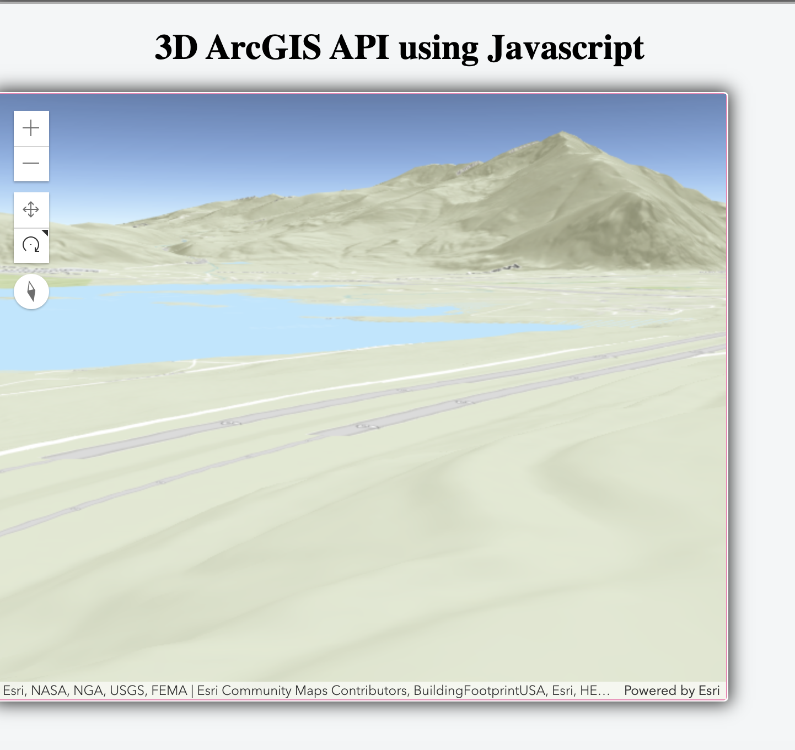

### ArcGIS for Developers
A small project of ArcGIS API 3D map to track wildfires in the United States.

As wildfires continue to impact California, Utah and Colorado, I want to create a tracker that searches and downloads the datasets and populates the corresponding latitude and longitude with the 3D aerial map view.

[WIP] Project requires more work with [InciWeb](https://gis-fema.hub.arcgis.com/datasets/inciweb-incident-information-system) API to properly overlay natural wildfires in the US. 

### Technologies Used
1. Javascript
2. HTML
3. CSS
4. Git

DEMO is [WIP]
